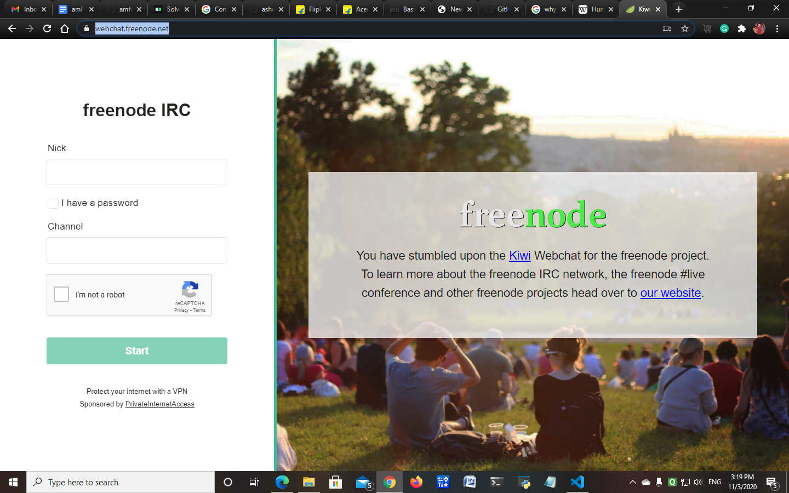

# **NICK** IN **IRC FREENODE**
- IRC Freenode is a open source software.     
- Where we can join any open source group and do some updates regarding software.
- I have searched so many webdites in google how to register, Finally i find the procedure to register in freenode .       
-----        
## Steps to register in IRC Freenode
1. Search [https://webchat.freenode.net/] in the browser. it looks like this picture.
 
2. Enter the **nick** what u want, and the channel name which u want to join.click on start botton. so with this **nick name u will join into the freenode server**. 
3. Remember the nick name when ever you login into this page u has to fill all the details. 
4. After u entered the freenode sever in the command block type the following .
     > ***/nick 'your nick'***          

    

5. Now To check whether the **nick name is available or not**
    > ***/msg NickServ INFO 'your nick'***    

    It will help u the **availability of the nick**.
6. To register your nick type the folloing coomand.you need to keep a **password** and **valid email name**
    > ***/msg NickServ REGISTER password your@example.com***    

    and click **Enter**
7. A **verification code** is sent to your respective email, **copy that code** and **paste in the freenode browser**.
8. After that your **nick name is successfully registered**.
9. To identify your nick 
     > ***/msg NickServ IDENTIFY your nick password*** 
10. To join any channel 
     > ***/join "channel name"***

     you will join into the channel's server           
----

### So successfully we registered into the IRC Freenode server😀😀