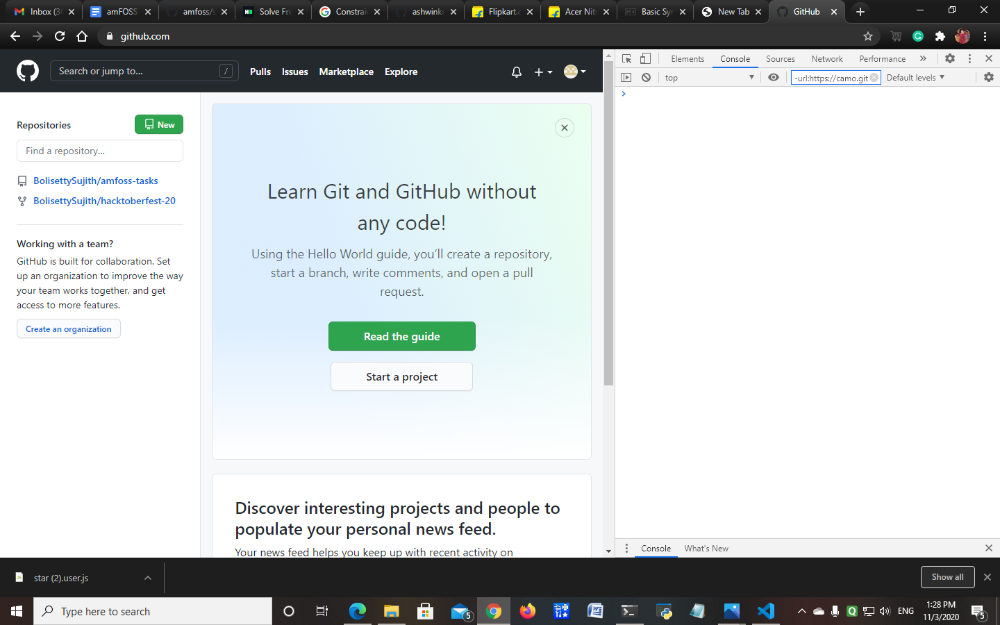
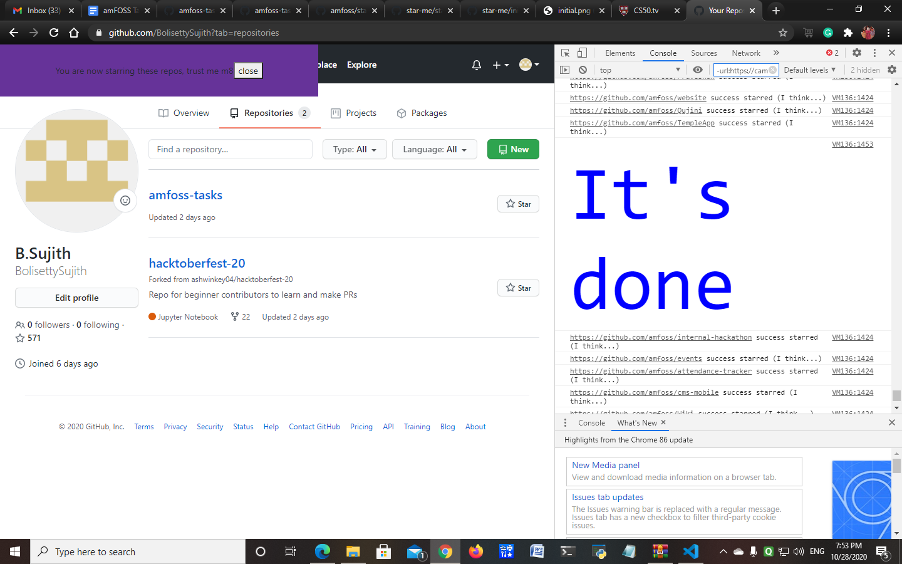

# Star-Me 
It is a simple task .    
The folloing steps help to do this task.

## Steps
-----
1. first we havs to **sign in to the github**     
> - If we don't have an account in github then create an account and sign in to github.
-----
2. Copy the entire script [https://raw.githubusercontent.com/amfoss/star-me/master/star.user.js]      
-----  
3. Make sure you are in *github browser* and open **Devoloper tools** in that brower. 
> - ### For linux and windows user    
>>To open developer tools on Chrome/Chromium please press **ctrl+shift+I** .      

> - For macOS 
>> To open developer tools please press **⌘+⌥+I**.     

>it should look like this       
    

----

4. Now click on the **Consol tab** in the Devolper tool. And make sure you are still are in github.
----
5. Paste the entire script in **consol** which you already copied in the star user file.      
Then hit **Enter**.      
-------
6. It takes some time to run the entire script.      
After few minutes you will see in the browser **It's Done** with **blue** colour.
   

Ok the task is completed😀😀😃.
